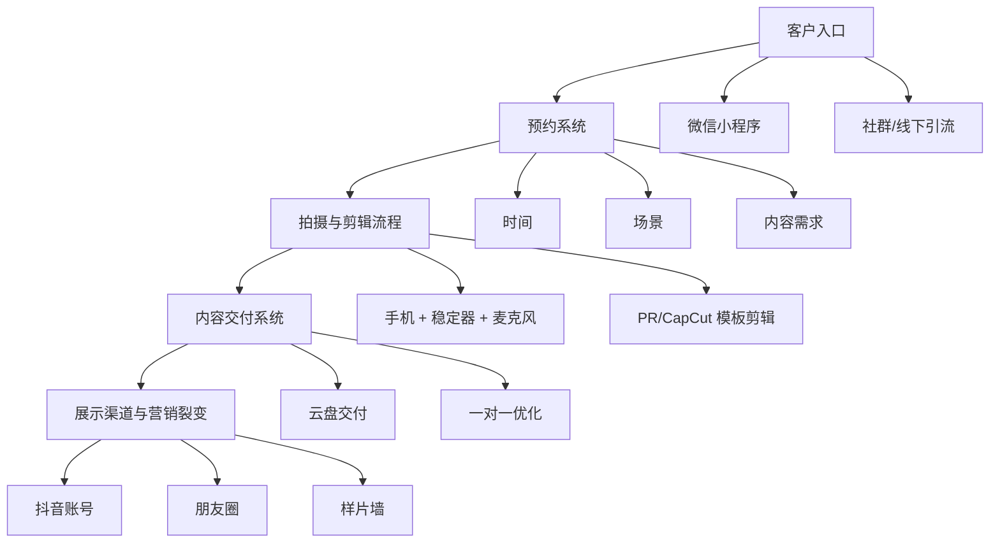

```mermaid
graph TD
  A[客户入口] --> B[预约系统]
  B --> C[拍摄与剪辑流程]
  C --> D[内容交付系统]
  D --> E[展示渠道与营销裂变]

  A --> A1[微信小程序]
  A --> A2[社群/线下引流]

  B --> B1[时间]
  B --> B2[场景]
  B --> B3[内容需求]

  C --> C1[手机 + 稳定器 + 麦克风]
  C --> C2[PR/CapCut 模板剪辑]

  D --> D1[云盘交付]
  D --> D2[一对一优化]

  E --> E1[抖音账号]
  E --> E2[朋友圈]
  E --> E3[样片墙]
```
